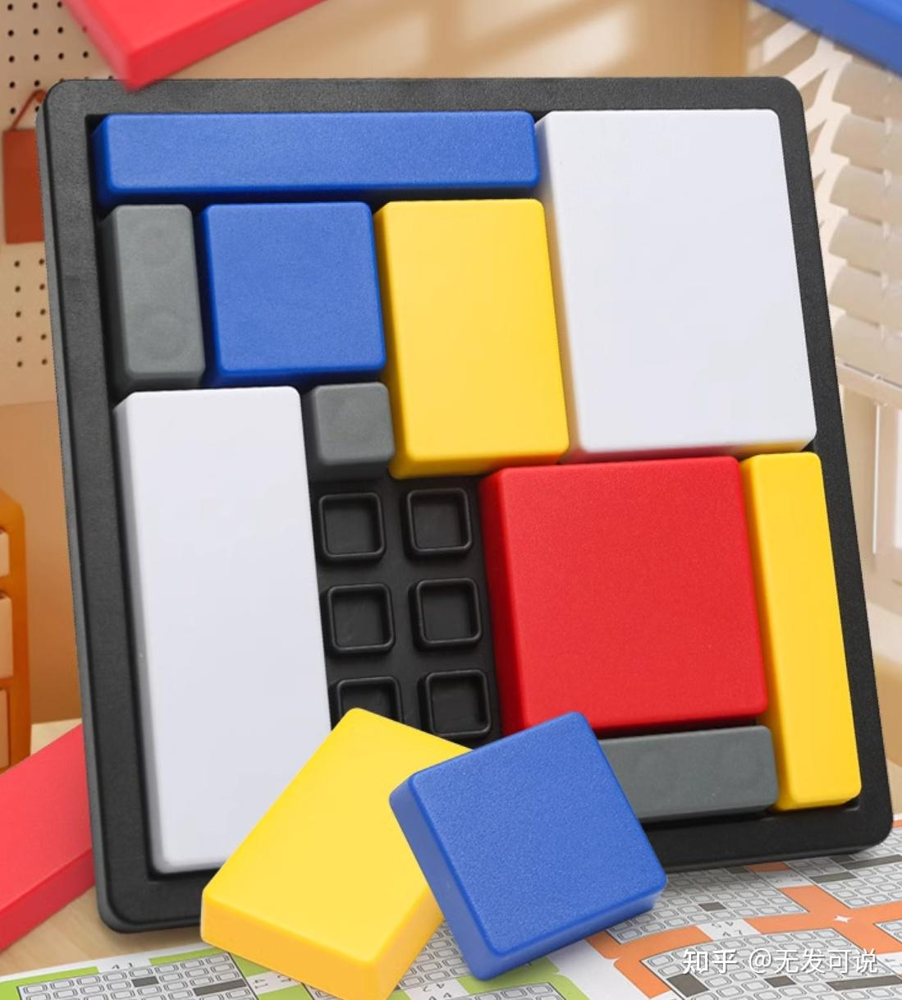

# 逻辑评图游戏
逻辑拼图，类似于七巧板，在8x8的放个上放置3个预先设置的方块，大小分别为1x2, 1x3, 1x4，如下图所示，


将所有的方块排序，
```
Red1: 4x2
Red2: 3x2
Yellow1: 4x3
Yellow2: 5x2
White1: 3x3
White2: 2x2
Blue1: 5x1
Blue2: 4x1
```
然后在一个8x8的数组里，找到空白的合乎大小的矩形块，将这些数组全部置为0，然后初始化6个方块为1，那么问题就转化为给出参数m,n ，希望找到所有的(x0,y0)(x1,y1)数对，使得所有a[x][y]  (x0<=x<=x1, y0<=x<=y1)都为0，且(x1-x0,y1-y0)=(m-1,n-1)或者(n-1,m-1)，找到以后，将对应的位置置为1，使用递归的方式找到下一个空白位置数对。

